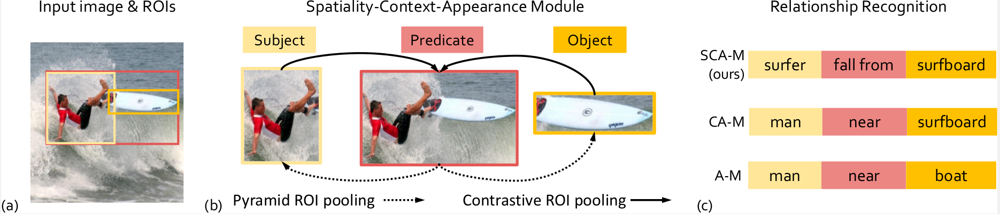
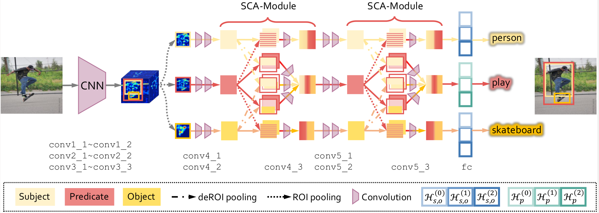
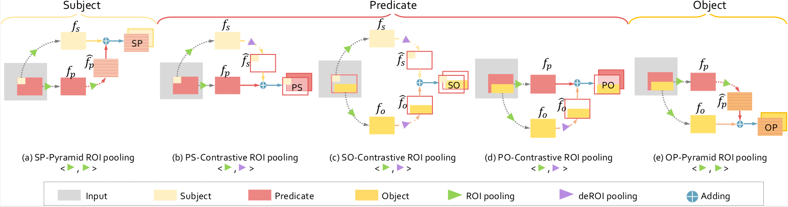
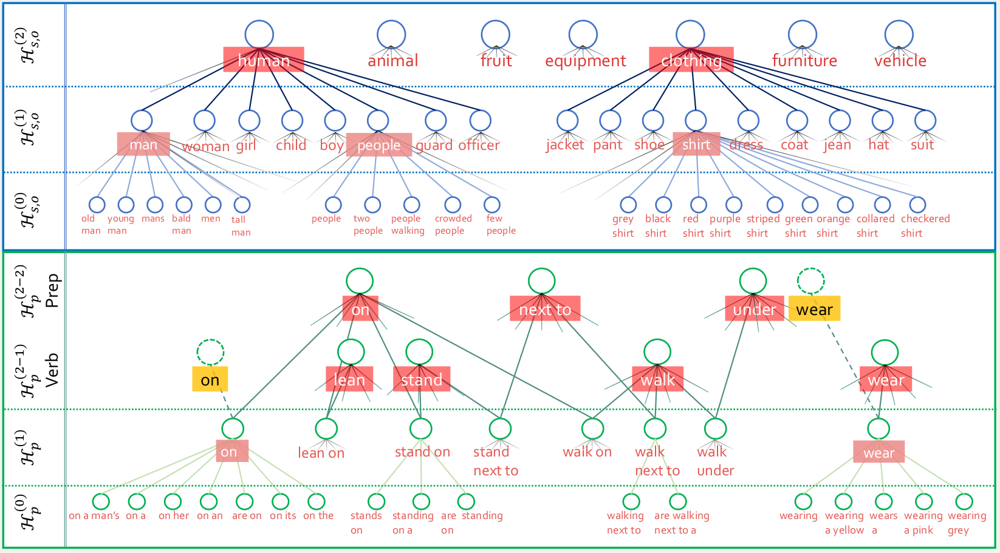
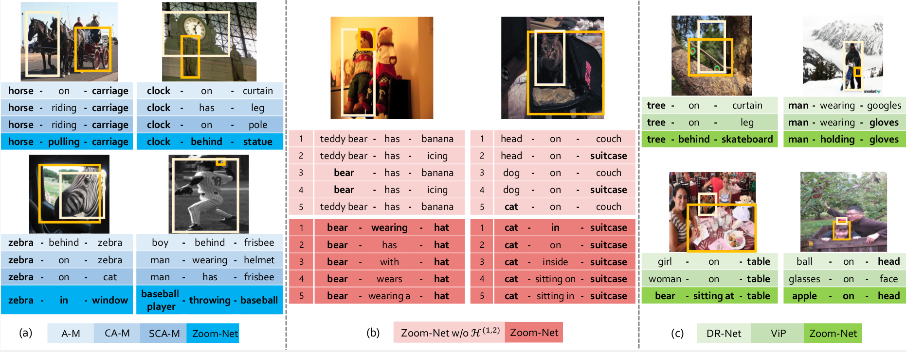

# Zoom-Net: Mining Deep Feature Interactions for Visual Relationship Recognition, ECCV 2018.

## Introduction
Recognizing visual relationships subject-predicate-object
among any pair of localized objects is pivotal for image understanding.
Previous studies have shown remarkable progress in exploiting linguistic
priors or external textual information to improve the performance. In
this work, we investigate an orthogonal perspective based on feature in-
teractions. We show that by encouraging deep message propagation and
interactions between local object features and global predicate features,
one can achieve compelling performance in recognizing complex rela-
tionships without using any linguistic priors. 

To this end, we present two new pooling cells to encourage feature interactions: (i) Contrastive ROI
Pooling Cell, which has a unique deROI pooling that inversely pools local
object features to the corresponding area of global predicate features. (ii)
Pyramid ROI Pooling Cell, which broadcasts global predicate features
to reinforce local object features. The two cells constitute a Spatiality-
Context-Appearance Module (SCA-M), which can be further stacked con-
secutively to form our final Zoom-Net. We further shed light on how one
could resolve ambiguous and noisy object and predicate annotations by
Intra-Hierarchical trees (IH-tree). 



Given an image above ‘surfer fall from surfboard ’ and its region-of-interests (ROI)
in (a), traditional methods without mining contextual interactions between object (sub-
ject) and predicate (e.g., Appearance Module (A-M)) or ignoring spatial informa-
tion (e.g., Context-Appearance Module (CA-M)) may fail in relationship recogni-
tion, as shown in the two bottom rows of (c). The proposed Spatiality-Context-
Appearance Module (SCA-M) in (b) permits global inter-object interaction and sharing
of spatiality-aware contextual information, thus leading to a better recognition perfor-
mance.

Extensive experiments conducted on
Visual Genome dataset demonstrate the effectiveness of our feature-
oriented approach compared to state-of-the-art methods (Acc@1 11.42%
from 8.16%) that depend on explicit modeling of linguistic interac-
tions. We further show that SCA-M can be incorporated seamlessly into
existing approaches to improve the performance by a large margin.

Our contributions are summarized as follows:

1) A general feature learning module that permits feature interactions - We intro-
duce a novel SCA-M to mining intrinsic interactions between low-level spatial
information and high-level semantical appearance features simultaneously. By
stacking multiple SCA-Ms into a Zoom-Net, we achieve compelling results on
VG dataset thanks to the multi-scale bidirectional message passing among sub-
ject, predicate and object.

2) Multi-class Intra-Hierarchical tree - To mitigate label ambiguity in large-scale
datasets, we reformulate the visual relationship recognition problem to a multi-
label recognition problem. The recognizability is enhanced by introducing an
Intra-Hierarchical tree (IH-tree) for the object and predicate categories, respec-
tively. We show that IH-tree can benefit other existing methods as well.

3) Large-scale relationship recognition - Extensive experiments demonstrate the
respective effectiveness of the proposed SCA-M and IH-tree, as well as their
combination on the challenging large-scale VG dataset.
It is noteworthy that the proposed method differs significantly from previous
works as Zoom-Net neither models explicit nor implicit label-level interactions
between subject-predicate-object . We show that feature-level interactions alone,
which is enabled by SCA-M, can achieve state-of-the-art performance. We fur-
ther demonstrate that previous state-of-the-arts that are based on label-level
interaction can benefit from the proposed SCA-M and IH-trees.


## Zoom-Net

### Overall Architecture 



The architecture of Zoom-Net. The subject (in light yellow), predicate (in red)
and object (in dark yellow) share the same feature extraction procedure in the lower
layers, and are then ROI-pooled into three branches. Following each branch of pooled
feature maps is two convolutional layers to learn appearance features which are then
fed into two stacked SCA-Ms to further fuse multi-scale spatiality-aware contextual in-
formation across different branches. Three classifiers with intra-hierarchy structures are
applied to the features obtained from each branch for visual relationship recognition.

### Spatiality-Context-Appearance Module (SCA-M)



The Spatiality-Context-Appearance Module (SCA-M) hinges on two components: (i) Contrastive ROI pooling (b-d), denoted as <ROI, deROI>, which propagates spatiality-aware features f_s, f_o from subject and object into the spatial `palette' of predicate features f_p, and (ii) Pyramid ROI pooling (a,e), <ROI, ROI>, which broadcasts the global predicate features f_p to local features f_s, f_o in subject and object branches.


### Intra-Hierarchical Tree (IH-Tree)



Both IH-trees for object (top) and predicate (bottom) start from the base layer H^{0}_{s,p,o} to a purified layer H^{1}_{s,p,o} but have a different construction in the third layer. The H^{2}_{o} clusters similar semantic concepts from H^{1}_{o} , while the H^{2}_{p} separately cluster verb and preposition words from H^{1}_{p}.


## Experiment Results

Qualitative results on VG dataset. (a) Comparison results with the variants
of different module configurations. (b) Results by discarding IH-trees. (c) Comparison
between Zoom-Net with state-of-the-art methods. (a) and (c) show Top-1 prediction
results while (b) provides Top-5 results for each method. The ground truth are in bold.



## Contact Information

If you have any problems or questions, please feel free contact the authors.

Guojun Yin, gjyin91@gmail.com or gjyin@mail.ustc.edu.cn


## Citation

If you want to use the code (the code will be released soon) or follow the paper, please cite as followings:

```
@inproceedings{gjyin_eccv2018,

 author = {Guojun Yin, Lu Sheng, Bin Liu, Nenghai Yu, Xiaogang Wang, Jing Shao, Chen Change Loy},
 
 title = {Zoom-Net: Mining Deep Feature Interactions for Visual Relationship Recognition},
 
 booktitle = {ECCV},
 
 year = {2018}
}

